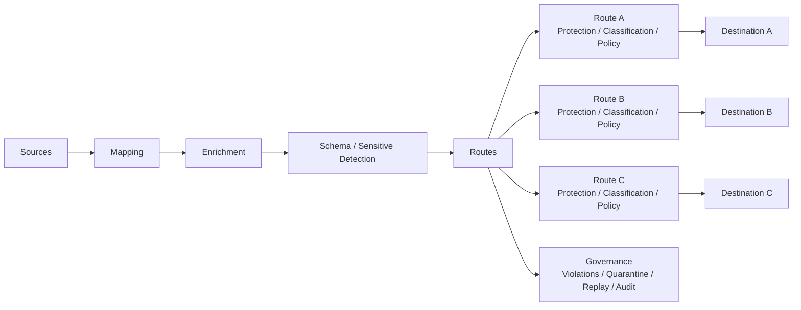

<h1 align="center">Data Relay Control</h1>

<p align="center">
  <strong>기업 데이터의 Control Plane.</strong>
</p>

<p align="center">
  하나의 Stream을 여러 Route와 Destination으로 전달하면서 수집, 변환, 보호, 통제, 감사합니다.
</p>

<p align="center">
  <a href="README.md">English</a> · <strong>한국어</strong> · <a href="https://control.datarelay.run/">제품 웹사이트</a>
</p>

<p align="center">
  
  
  
  
</p>

<p align="center">
  <strong>제품 웹사이트:</strong> <a href="https://control.datarelay.run/">control.datarelay.run</a>
</p>

---

## 데이터가 어떻게 이동하는지 통제합니다

Data Relay Control은 source-available **Enterprise Data Control Gateway**입니다.

기업의 데이터 Source와 외부 Destination 사이에서 데이터를 수집하고 변환한 뒤, Route별 보호·분류·Policy를 적용하고 실제 전달 상태를 관찰하며 동일한 Stream을 여러 Destination으로 안전하게 전달합니다.

> **One Stream → Many Routes → Many Destinations**

Data Relay Control의 목적은 **Data Delivery와 Data Control**입니다. SIEM, SOAR, Data Lake, IAM, Ticketing, AI Agent Platform으로 확장하는 제품이 아닙니다.

## 주요 기능

| 기능 | 제공하는 것 |
|---|---|
| **수집** | HTTP API polling, Webhook Receiver, PostgreSQL Database Query |
| **변환** | Mapping, Enrichment, JSONPath/JSONata/regex 기반 processing |
| **전달** | Multi-route delivery, destination별 processing, dynamic routing, failover |
| **보호** | Schema Drift, Sensitive Detection, Protection, Classification, Policy |
| **Governance** | Violations, Quarantine, Replay, Approvals, Audit, Notifications |
| **운영** | Dashboard, Streams, runtime health, delivery status, checkpoint |
| **권한 통제** | RBAC 기반 operator/governance surface |

현재 제한 사항은 [`docs/release/KNOWN-LIMITATIONS.md`](docs/release/KNOWN-LIMITATIONS.md)에서 관리합니다.

## Architecture



지원되는 runtime 모델은 Route-based Processing입니다. Destination별 차이를 위해 Stream을 복제하지 않고 Route에서 처리합니다.

## 빠른 시작

### 요구사항

- Docker Engine 24+
- Docker Compose v2
- TCP **18080** — HTTP
- TCP **18443** — HTTPS

### 설치 및 실행

```bash
git clone https://github.com/datarelay-labs/gdc-platform.git datarelay-control
cd datarelay-control
cp .env.example .env

# Production에서는 JWT_SECRET_KEY, SECRET_KEY,
# ENCRYPTION_KEY, POSTGRES_PASSWORD를 설정합니다.

docker compose -f docker-compose.platform.yml up -d
```

또는 release installer를 사용합니다.

```bash
./scripts/release/install.sh
```

접속:

```text
https://localhost:18443/
http://localhost:18080/
```

기본 bootstrap 로그인은 `admin / admin`이며 첫 로그인에서 비밀번호 변경이 필요합니다. `.env`의 `GDC_SEED_ADMIN_PASSWORD`로 초기 비밀번호를 변경할 수 있습니다.

처음부터 전체 흐름을 따라가려면 [Getting Started](docs/getting-started/GETTING-STARTED.md)를 참고합니다.

## 첫 Stream

Stream Wizard는 제품 모델을 그대로 따릅니다.

| 단계 | 작업 |
|---|---|
| **Connect** | Connector를 선택하고 Source 구성 |
| **Sample** | Source 테스트, record path 선택, checkpoint 확인 |
| **Destinations** | 하나 이상의 전달 대상 선택 |
| **Route Processing** | 공통 processing과 destination별 override 구성 |
| **Deploy** | Decision Center 검토 후 Stream 생성 및 전달 시작 |

배포 후 **Dashboard**와 **Streams**에서 runtime 상태와 delivery health를 확인합니다.

## 핵심 원칙

```text
Data Control First
Runtime Is Truth
Every Data Is Untrusted
Policy First
Governance Before Automation
```

Runtime path, checkpoint, delivery log, metric이 실제로 발생한 동작의 증거입니다.

## 제품 경계

Data Relay Control은 다음 제품으로 확장하지 않습니다.

- SIEM / XDR / SOAR
- Case Management / Ticketing
- Data Lake / Data Warehouse / BI
- Enterprise IAM / SSO / Identity Provider
- AI Agent Platform / LLM Hosting
- Multi-node Cluster / Distributed Scheduler

제품 경계는 README가 아니라 현재 Product Charter가 결정합니다.

## Source of Truth

Repository authority map:

[`docs/architecture/source-of-truth-index.md`](docs/architecture/source-of-truth-index.md)

최상위 제품 authority:

[`docs/source-of-truth/PRODUCT-CHARTER-Version-1.2.1-FINAL.txt`](docs/source-of-truth/PRODUCT-CHARTER-Version-1.2.1-FINAL.txt)

현재 implementation contract:

[`specs/`](specs/)

README, architecture overview, release note, 외부 문서는 derived explanation입니다. 현재 canonical product authority와 충돌하면 canonical source가 우선합니다.

## 개발

Backend:

```bash
python -m venv .venv
source .venv/bin/activate
pip install -r requirements.txt
cp .env.example .env
uvicorn app.main:app --reload --host 0.0.0.0 --port 8000
```

Frontend:

```bash
cd frontend
npm install
npm run dev
```

Validation:

```bash
./scripts/test/run-backend-full.sh
cd frontend && npm run validate
```

Affected validation은 repository의 Engineering System metadata와 native CI mapping을 따릅니다.

## 문서

| 주제 | 링크 |
|---|---|
| 제품 웹사이트 | **https://control.datarelay.run/** |
| Documentation Hub | [`docs/README.md`](docs/README.md) |
| Getting Started | [`docs/getting-started/GETTING-STARTED.md`](docs/getting-started/GETTING-STARTED.md) |
| Current Architecture | [`docs/architecture/OSS-v1-ARCHITECTURE.md`](docs/architecture/OSS-v1-ARCHITECTURE.md) |
| Authority Map | [`docs/architecture/source-of-truth-index.md`](docs/architecture/source-of-truth-index.md) |
| Known Limitations | [`docs/release/KNOWN-LIMITATIONS.md`](docs/release/KNOWN-LIMITATIONS.md) |
| Production Checklist | [`docs/release/production-checklist.md`](docs/release/production-checklist.md) |
| Operator Runbook | [`docs/operator-runbook.md`](docs/operator-runbook.md) |
| Release Notes | [`docs/release/OSS-v1.0-GA-RELEASE-NOTES.md`](docs/release/OSS-v1.0-GA-RELEASE-NOTES.md) |
| Release History | [`CHANGELOG.md`](CHANGELOG.md) |

## License

**Data Relay Control은 source-available이며 open source가 아닙니다.**

**Data Relay Source Available License 1.0**은 라이선스 조건에 따라 개인 사용, 교육/연구, 평가, 내부 상업적 사용, 내부 수정, customer-owned deployment를 허용합니다.

Resale, OEM/embedding, white-labeling, commercial redistribution, derivative/competing commercial product, SaaS/MSP 제공에는 별도의 서면 commercial license가 필요합니다.

전체 조건은 [`LICENSE`](LICENSE)를 확인하십시오.

---

<p align="center">
  <strong>데이터를 수집하고, 이동 방식을 통제하고, 실제로 무슨 일이 일어났는지 확인합니다.</strong>
</p>

<p align="center">
  <a href="https://control.datarelay.run/">제품 웹사이트</a> ·
  <a href="docs/getting-started/GETTING-STARTED.md">Getting Started</a> ·
  <a href="docs/architecture/source-of-truth-index.md">Source of Truth</a>
</p>
