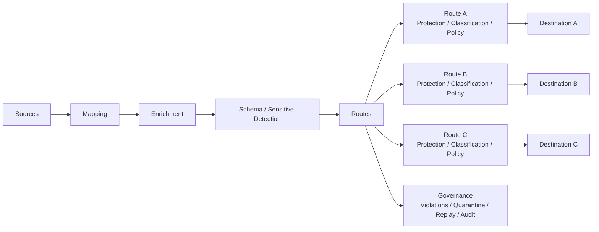

<h1 align="center">Data Relay Control</h1>

<p align="center">
  <strong>The Control Plane for Enterprise Data.</strong>
</p>

<p align="center">
  Collect, transform, protect, govern, and deliver enterprise data through one Stream → many Routes → many Destinations.
</p>

<p align="center">
  <strong>English</strong> · <a href="README.ko.md">한국어</a> · <a href="https://control.datarelay.run/">Product Website</a>
</p>

<p align="center">
  
  
  
  
</p>

<p align="center">
  <strong>Product website:</strong> <a href="https://control.datarelay.run/">control.datarelay.run</a>
</p>

---

## Control what data moves

Data Relay Control is a source-available **Enterprise Data Control Gateway**.

It sits between data sources and external destinations so enterprises can collect data, transform it, apply route-specific protection and policy, observe what actually happened, and deliver the same Stream to multiple Destinations without duplicating pipelines.

> **One Stream → Many Routes → Many Destinations**

The product is designed for **data delivery and data control**. It is not a SIEM, SOAR, data lake, IAM platform, ticketing system, or AI-agent platform.

## What it does

| Capability | What Data Relay Control provides |
|---|---|
| **Collect** | HTTP API polling, webhook receiver, and PostgreSQL database-query source |
| **Transform** | Mapping, enrichment, JSONPath/JSONata/regex-based processing |
| **Route** | Multi-route delivery, destination-specific processing, dynamic routing and failover |
| **Protect** | Schema drift, sensitive-data detection, protection, classification and policy |
| **Govern** | Violations, quarantine, replay, approvals, audit and notifications |
| **Operate** | Dashboard, Streams console, runtime health, delivery status and checkpoints |
| **Control access** | RBAC-gated operator and governance surfaces |

Known limitations are maintained in [`docs/release/KNOWN-LIMITATIONS.md`](docs/release/KNOWN-LIMITATIONS.md).

## Architecture



The supported runtime model is route-based processing. Destination-specific differences belong on Routes rather than duplicated Streams.

## Quick start

### Requirements

- Docker Engine 24+
- Docker Compose v2
- TCP **18080** for HTTP
- TCP **18443** for HTTPS

### Install and run

```bash
git clone https://github.com/datarelay-labs/gdc-platform.git datarelay-control
cd datarelay-control
cp .env.example .env

# Set JWT_SECRET_KEY, SECRET_KEY, ENCRYPTION_KEY,
# and POSTGRES_PASSWORD before production use.

docker compose -f docker-compose.platform.yml up -d
```

Or use the release installer:

```bash
./scripts/release/install.sh
```

Open:

```text
https://localhost:18443/
http://localhost:18080/
```

Default bootstrap login is `admin / admin`; a password change is required on first login. Override the bootstrap password with `GDC_SEED_ADMIN_PASSWORD` in `.env`.

For a full first-pipeline walkthrough, see [Getting Started](docs/getting-started/GETTING-STARTED.md).

## First Stream

The Stream wizard follows the product model directly:

| Step | Action |
|---|---|
| **Connect** | Select a connector and configure the source |
| **Sample** | Test the source, select the record path, confirm the checkpoint |
| **Destinations** | Select one or more delivery targets |
| **Route Processing** | Configure shared processing and destination-specific overrides |
| **Deploy** | Review the decision center, create the Stream, start delivery |

After deployment, use **Dashboard** and **Streams** to monitor runtime state and delivery health.

## Core principles

```text
Data Control First
Runtime Is Truth
Every Data Is Untrusted
Policy First
Governance Before Automation
```

The runtime path, checkpoints, delivery logs, and metrics are evidence of what actually happened.

## Product boundaries

Data Relay Control deliberately does **not** expand into:

- SIEM / XDR / SOAR
- Case management or ticketing
- Data lake / data warehouse / BI platform
- Enterprise IAM / SSO / Identity Provider
- AI-agent platform or LLM hosting platform
- Multi-node cluster or distributed scheduler platform

The product boundary is defined by the current Product Charter, not by README wording.

## Source of truth

The repository authority map is:

[`docs/architecture/source-of-truth-index.md`](docs/architecture/source-of-truth-index.md)

Top-level product authority:

[`docs/source-of-truth/PRODUCT-CHARTER-Version-1.2.1-FINAL.txt`](docs/source-of-truth/PRODUCT-CHARTER-Version-1.2.1-FINAL.txt)

Current implementation contracts live under:

[`specs/`](specs/)

The README, architecture overviews, release notes, and external documentation are derived explanations. If they conflict with current canonical product authority, the canonical source wins.

## Development

Backend:

```bash
python -m venv .venv
source .venv/bin/activate
pip install -r requirements.txt
cp .env.example .env
uvicorn app.main:app --reload --host 0.0.0.0 --port 8000
```

Frontend:

```bash
cd frontend
npm install
npm run dev
```

Validation:

```bash
./scripts/test/run-backend-full.sh
cd frontend && npm run validate
```

Use the repository's Engineering System metadata and native CI mapping for affected validation.

## Documentation

| Topic | Link |
|---|---|
| Product website | **https://control.datarelay.run/** |
| Documentation hub | [`docs/README.md`](docs/README.md) |
| Getting Started | [`docs/getting-started/GETTING-STARTED.md`](docs/getting-started/GETTING-STARTED.md) |
| Current architecture | [`docs/architecture/OSS-v1-ARCHITECTURE.md`](docs/architecture/OSS-v1-ARCHITECTURE.md) |
| Authority map | [`docs/architecture/source-of-truth-index.md`](docs/architecture/source-of-truth-index.md) |
| Known limitations | [`docs/release/KNOWN-LIMITATIONS.md`](docs/release/KNOWN-LIMITATIONS.md) |
| Production checklist | [`docs/release/production-checklist.md`](docs/release/production-checklist.md) |
| Operator runbook | [`docs/operator-runbook.md`](docs/operator-runbook.md) |
| Release notes | [`docs/release/OSS-v1.0-GA-RELEASE-NOTES.md`](docs/release/OSS-v1.0-GA-RELEASE-NOTES.md) |
| Release history | [`CHANGELOG.md`](CHANGELOG.md) |

## License

**Data Relay Control is source-available, not open source.**

The **Data Relay Source Available License 1.0** permits personal use, education/research, evaluation, internal commercial use, internal modification, and customer-owned deployment under its terms.

Resale, OEM/embedding, white-labeling, commercial redistribution, derivative or competing commercial products, and SaaS/MSP offerings of the software's functionality require a separate written commercial license.

See [`LICENSE`](LICENSE) for the complete terms.

---

<p align="center">
  <strong>Collect data. Control how it moves. Know what happened.</strong>
</p>

<p align="center">
  <a href="https://control.datarelay.run/">Product Website</a> ·
  <a href="docs/getting-started/GETTING-STARTED.md">Getting Started</a> ·
  <a href="docs/architecture/source-of-truth-index.md">Source of Truth</a>
</p>
